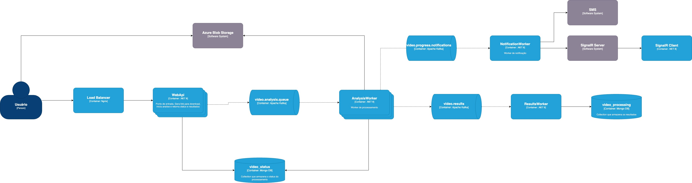

# QrFinder - Documentação Técnica

## 1. Visão Geral da Arquitetura

### Arquitetura de Microserviços Distribuída

O QrFinder implementa uma arquitetura de microserviços, com processamento assíncrono e escalabilidade horizontal.



## 2. Justificativas Técnicas das Decisões Arquiteturais

### 2.1 Clean Architecture

**Decisão:** Implementação da Clean Architecture com separação em camadas (Domain, Application, Infrastructure, WebAPI).

**Justificativa:**
- **Testabilidade:** Permite testes unitários isolados com mock das dependências
- **Manutenibilidade:** Separação clara de responsabilidades
- **Flexibilidade:** Facilita mudanças de tecnologia sem impactar regras de negócio
- **Inversão de Dependência:** Core da aplicação independe de frameworks externos

### 2.2 Mensageria Assíncrona com Apache Kafka

**Decisão:** Uso do Kafka para processamento assíncrono de vídeos.

**Justificativa:**
- **Performance:** Processamento não-bloqueante permite alto throughput
- **Escalabilidade:** Particionamento permite processamento paralelo
- **Confiabilidade:** Garantia de entrega e persistência de mensagens
- **Desacoplamento:** Produtores e consumidores independentes

**Configuração:**
```yaml
Topics:
  - video.analysis.queue: 3 partições (1:1 com workers). Pode ser aumentado.
  - video.progress: 1 partição (atualizações de status)
  - videos.results: 1 partição (resultados finais)
  - video.progress.notifications: 1 partição (notificações)
```

### 2.3 Processamento Distribuído com Workers

**Decisão:** Múltiplos workers especializados (Analysis, Results, Notifications).

**Justificativa:**
- **Escalabilidade Horizontal:** Cada worker pode ser escalado independentemente
- **Isolamento de Falhas:** Falha em um worker não afeta outros
- **Especialização:** Cada worker otimizado para sua responsabilidade
- **Throughput:** Processamento paralelo de múltiplos vídeos

### 2.4 Biblioteca OpenCV para Detecção de QR Code

**Decisão:** Uso do OpenCV com ZXing.Net para detecção de QR codes.

**Justificativa:**
- **Precisão:** OpenCV oferece algoritmos robustos de visão computacional
- **Performance:** Processamento otimizado de frames de vídeo
- **Maturidade:** Biblioteca estável e amplamente utilizada
- **Flexibilidade:** Suporte a múltiplos formatos de vídeo

### 2.5 MongoDB como Banco de Dados

**Decisão:** MongoDB para persistência de status e resultados.

**Justificativa:**
- **Flexibilidade de Schema:** Facilita evolução dos modelos de dados
- **Performance:** Otimizado para operações de leitura/escrita intensivas
- **Escalabilidade:** Suporte nativo a sharding e replicação
- **JSON Nativo:** Integração natural com APIs REST

### 2.6 Load Balancer com Nginx

**Decisão:** Nginx como proxy reverso e load balancer.

**Justificativa:**
- **Alta Performance:** Excelente performance para proxy HTTP
- **Flexibilidade:** Roteamento baseado em path para diferentes serviços
- **Confiabilidade:** Detecção automática de falhas de backend
- **Simplicidade:** Configuração declarativa e clara

### 2.7 Azure Blob Storage

**Decisão:** Azure Blob Storage para armazenamento de vídeos com upload direto via SAS URLs.

**Justificativa:**
- **Eliminação de Gargalos:** Upload direto evita passagem pela API
- **Performance:** Infraestrutura global da Microsoft otimizada
- **Escalabilidade:** Crescimento automático sem limites práticos
- **Confiabilidade:** SLA de 99,9% com redundância geográfica
- **Custo-Benefício:** ~$0,002 por vídeo de 100MB incluindo operações
- **Simplicidade:** Zero manutenção de infraestrutura de storage


## 3. Atendimento aos Requisitos Não-Funcionais

### 3.1 Performance

**Implementação:**
- **Processamento Assíncrono:** Upload e processamento desacoplados
- **Processamento Paralelo:** Múltiplos workers processando simultaneamente
- **Load Balancing:** Distribuição de carga entre múltiplas APIs

### 3.2 Escalabilidade

**Implementação:**
- **Horizontal Scaling:** Todos os serviços podem ser escalados independentemente
- **Particionamento Kafka:** 3 partições para análise permitem 3 workers paralelos
- **Stateless Services:** APIs sem estado permitem replicação simples
- **Load Balancer:** Nginx distribui carga automaticamente

**Configurações de Escala:**
```bash
# Básico: 1 API + 1 Worker
make demo-basic

# Escalado: 3 APIs + 3 Workers
make demo-scaled

# Customizado: Até 5 APIs + 5 Workers
make scale-all API=5 ANALYSIS=5
```

### 3.3 Confiabilidade

**Implementação:**
- **Reprocessamento:** Kafka garante reprocessamento em caso de falha
- **Health Checks:** Monitoramento contínuo dos serviços
- **Graceful Degradation:** Sistema continua funcionando com workers reduzidos
- **Commit Após Sucesso:** Kafka commit apenas após processamento bem-sucedido

### 3.4 Monitoramento e Observabilidade

**Implementação:**
- **Log Estruturado:** Logs com TraceId para correlação

### 3.5 Disponibilidade

**Implementação:**
- **Múltiplas Instâncias:** APIs e workers replicados
- **Detecção de Falhas:** Load balancer remove instâncias com falha
- **Restart Automático:** Docker restart em caso de crash
- **Persistência:** Estado mantido no MongoDB

## 4. Tecnologias Utilizadas

### Backend
- **.NET 8:** Framework principal
- **MediatR:** Implementação do padrão CQRS
- **FluentResults:** Tratamento funcional de erros
- **OpenCV:** Processamento de vídeo e detecção de QR codes

### Infraestrutura
- **Docker & Docker Compose:** Containerização e orquestração
- **Apache Kafka:** Message broker para processamento assíncrono
- **MongoDB:** Banco de dados NoSQL
- **Nginx:** Load balancer e proxy reverso
- **Azurite:** Emulador do Azure Blob Storage

### Frontend
- **SignalR:** Notificações em tempo real
- **JavaScript:** Interações dinâmicas na UI

### DevOps
- **GitHub Actions:** Pipeline de CI/CD
- **Azure Blob Storage:** Armazenamento de vídeos

## 5. Fluxo de Processamento

### 5.1 Upload de Vídeo

1. **Geração de Link:** API gera SAS URL para upload direto
2. **Upload Assíncrono:** Cliente faz upload diretamente para storage
3. **Confirmação:** API confirma recebimento e enfileira para análise

### 5.2 Processamento de Análise

1. **Consumo Kafka:** Worker consume mensagem de análise
2. **Download Vídeo:** Worker baixa vídeo do storage
3. **Análise Frames:** Processamento frame por frame com OpenCV
4. **Detecção QR:** Identificação e decodificação de QR codes
5. **Resultados:** Publicação dos resultados via Kafka

### 5.3 Notificações

1. **Atualizações Status:** Workers publicam progresso via Kafka
2. **SignalR:** Notifications Worker envia atualizações em tempo real
3. **Persistência:** Resultados finais salvos no MongoDB

## 6. Configuração de Ambiente

### Desenvolvimento Local
```bash
make demo-basic    # 1 instância de cada serviço
make demo-scaled   # 3 APIs + 3 workers para alta performance
```

## 7. Considerações de Implementação

### 7.1 Estratégias de Economia de Custos
- **Políticas de Ciclo de Vida:** Movimento automático entre tiers de storage (Hot → Cool → Archive)
- **Compressão:** Redução de custos de armazenamento pós-processamento
- **Escolha de Região:** Seleção de regiões com melhor custo-benefício

### 7.2 Configurações de Performance
- **Workers Analysis:** Configurados para 1 vídeo por vez (evita travamentos)
- **Partições Kafka:** 3 partições para processamento paralelo otimizado
- **Health Checks:** Remoção automática de instâncias não responsivas
- **Timeouts:** Otimizados para operações de longa duração

### 7.3 Benefícios da Arquitetura Escolhida
- **Eliminação de Gargalos:** Upload direto para storage via SAS URLs
- **Zero Downtime:** Load balancing com múltiplas instâncias
- **Garantia de Entrega:** Kafka persiste mensagens em disco com replay capability
- **Simplicidade Operacional:** Serviços gerenciados reduzem overhead de manutenção

## 8. Testes e Qualidade

### Cobertura de Testes
- **Testes Unitários:** Cobertura completa dos use cases
- **Testes de Integração:** Fluxo completo de processamento
- **Testes de Carga:** Validação com 20+ vídeos simultâneos

### Pipeline de Qualidade
- Build automático em cada commit
- Execução de todos os testes
- Deploy automático em caso de sucesso
- Rollback automático em caso de falha